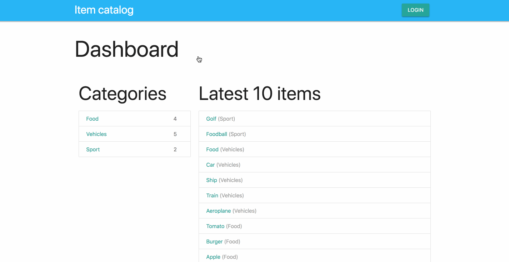
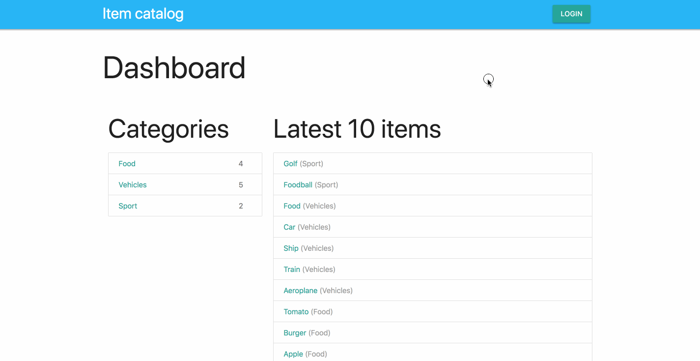

# Item Catalog

This is a demo flask application implementing OAuth with Google, Facebook and Github.

As a guest, you can show categories and the related items. If you log in, you
can add, edit or remove items within the predefined categories.

## App-Demo


## Login-Demo


<!-- MarkdownTOC levels="1" autolink=true autoanchor=false bracket="round" -->

- [Installation](#installation)
  - [Set up Google OAuth2](#set-up-google-oauth2)
  - [Set up Facebook OAuth2](#set-up-facebook-oauth2)
  - [Set up Github OAuth2](#set-up-github-oauth2)

<!-- /MarkdownTOC -->

## Installation

Install the dependencies:

```sh
pip install -r requirements.txt
```

Create a `settings.cfg` file with app-settings:

```sh
ln -s development.cfg settings.cfg
```

Setup the SQLite-DB:

```sh
python database_setup.py [-h] [--with-example-content] [--purge]
```

Then start your flask-application server:

```sh
python application.py
```

### Set up Google OAuth2

- Create a new app in the [Google Cloud Console](https://console.cloud.google.com/)
- Go to "API's and Services" => "Credentials" and create a new `OAuth client ID`
- Download the Client-Secret JSON and place it within this folder with the name `google_secrets.json`

### Set up Facebook OAuth2

- Create a new app in the [Facebook Developer Center](https://developers.facebook.com/apps)
- Copy the following code into a file called `facebook_secrets.json`

```
{
  "web": {
    "app_id": "your app id",
    "app_secret": "your app secret"
  }
}
```

### Set up Github OAuth2

- Create a new app in the [Github Developer Settings](https://github.com/settings/developers)
- Copy the following code into a file called `github_secrets.json`

```
{
  "web": {
    "app_id": "your app id",
    "app_secret": "your app secret"
  }
}
```
